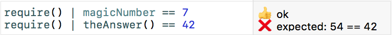

# Swordfish
A, playground-friendly, Swift-native, unit test framework

This is just a proof-of-concept - not recommended for serious work - and subject to change.

### To setup in a full project

To use in a Swift project in XCode or AppCode, create a test target as you would for an XCTest approach and 
drop the Swordfish.swift file in from the srcs folder (later we might worry about packages).

Derive a test class from `SwordfishTests` (actually you could just derive from `XCTest` 
but this way you don't need to `import XCTest`) and create test methods as normal
(they will be run by the built-in XCTest runner).

### To setup in a Playground

Create or open a Playground, then copy the SwordfishForPlaygrounds.swift file
from the srcs folder into the Sources folder of the playground.
In a playground you don't create test cases - just write assertions (see below)
and they will evaluate to a readable result in the Results Sidebar.

### Asserting yourself

Instead of `XCTest...` assertions you use something like the following:

`require() | a == b`

Where `a` and `b` are values that you might normally pass to `XCTAssertEquals()`.

Here's an example of how the output looks in a Playground:



You can optionally provide a description string to `require()`, in which case it is
recommended you format like this:

```swift
require("The answer to life, the universe and everything")
    | theAnswer() == 42
```

As well as `==`, the `!=` operator is currently supported.
Other comparison operators will be added - and full matchers are planned -
as well as an alternate runner to XCTest (which should enable a more BDD style, too).

If and when you hit the limitations of the framework as they currently stand,
you can still fall back to XCTest assertions, so feel free to experiment.
